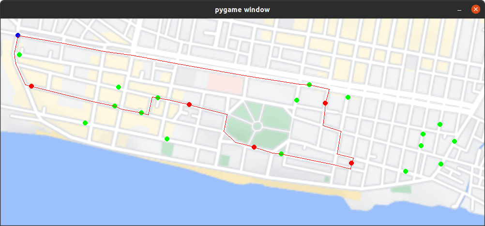
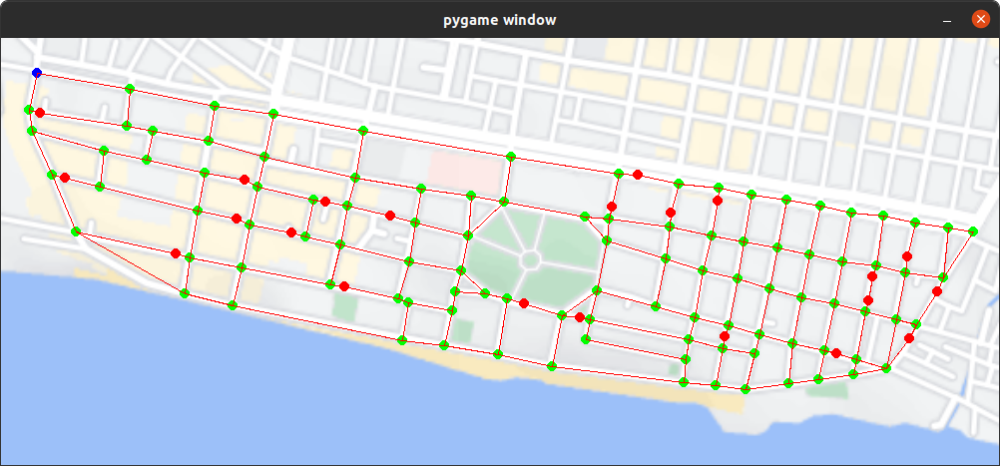

# Smart Garbage Monitoring System

A team project to develop a system for monitoring garbage levels in bins and determining the most efficient path for garbage collection trucks.

This project was inspired by and developed with reference to the work of [Kousheek Chakraborty](https://github.com/koushcheek). Our team expanded and adapted the original concepts to build an end-to-end software solution for efficient garbage monitoring and collection in urban environments. The solution consists of an IoT-enabled embedded electronics module, a real-time cloud database, and a Python application.

An example trajectory in our hometown is attached below.



## About The Project

The idea behind this project is that currently, garbage trucks follow fixed circuits visiting every garbage bin daily. Our study showed many bins are not full and do not require daily visits. To optimize this, we created a system that informs garbage collection staff which bins need to be emptied, so they avoid unnecessary visits. This saves time, fuel, and money by optimizing the truck’s route. Simulations predict a 50% reduction in fuel usage and halving the circuit completion time.

The complete system consists of 3 major parts:
* An **Arduino-based embedded device** installed on garbage bins, measuring the garbage level using an ultrasonic distance sensor and uploading data to a cloud database. Each unit has a unique ID.
* A **real-time database** built using Firebase to track garbage levels.
* A **Python app** that reads the database, identifies bins needing emptying, and generates the shortest path for collection trucks using Dijkstra's algorithm.

## Getting Started

### Prerequisites
* Python3
    * firebase_admin
    * pygame
* Arduino IDE
    * ESP8266WiFi drivers
    * Firebase_ESP_Client
    * NewPing

## Usage

The first step is to generate the graph of the town where the nodes represent either intersections, bins or the garage and the edges represent the roads. To do this, add a new directory containing a screenshot of your town to the **data/maps** directory. Refer to the existing example.

Next navigate to the directory you cloned earlier and run the following command:
```

python3 -m utils.generate\_graph --town\_name NAME\_OF\_YOUR\_TOWN\_HERE

```

Here are the features of the app:
* **Left mouse button click** adds an intersection node
* **Right mouse button click** adds a bin node
* **Middle mouse button click** adds a garage node (starting point)
* **Hovering over a node and pressing x** removes the node
* **Left mouse button click on two consecutive nodes** creates an edge between them
* **Space button** saves the graph as an adjacency list

To verify the graph you can run the following command:
```

python3 -m utils.load\_graph --town\_name NAME\_OF\_YOUR\_TOWN\_HERE

```

Complete the initialization process by running the following two commands:
```

python3 -m utils.generate\_bin\_data --town\_name NAME\_OF\_YOUR\_TOWN\_HERE
python3 -m utils.firebase\_init --town\_name NAME\_OF\_YOUR\_TOWN\_HERE

```

Next upload the Arduino script, change the BIN_ID on line 64 to the appropriate ID, and upload the script.

Finally, run the following command to get the shortest path that covers all the active bins:
```

python3 -m src.shortest\_path --town\_name NAME\_OF\_YOUR\_TOWN\_HERE

```

### Graph generation



### Trajectory generation


```
